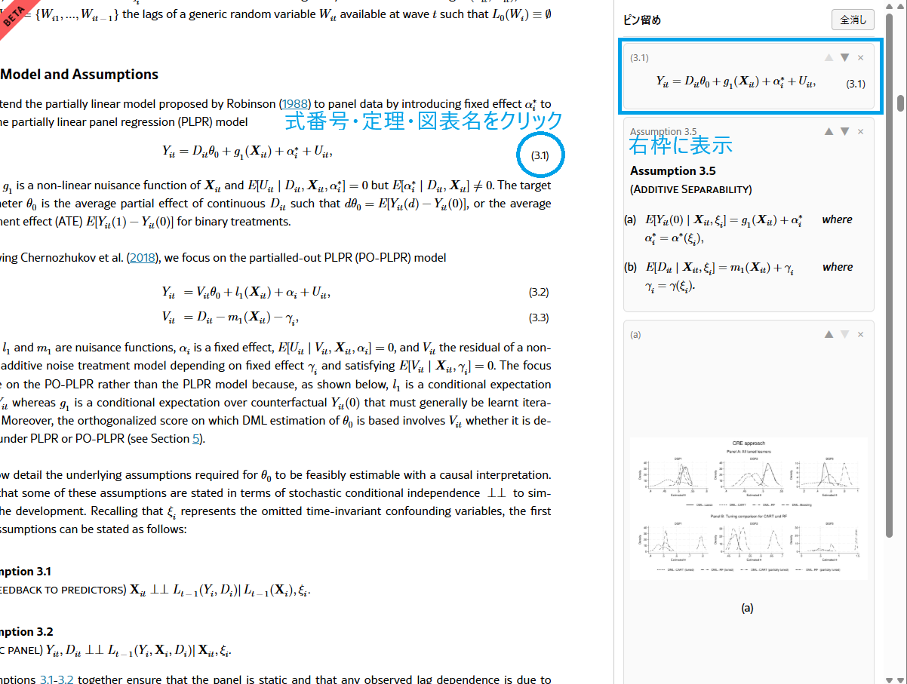

# arxiv-pin

[](https://github.com/sho-610/arxiv-pin/actions/workflows/ci.yml)
[](LICENSE)

arXiv の HTML 版論文に**ピン留めパネル**を追加し、式・図・表・仮定を右側に並べたまま本文を読めるようにするツールです。

## なぜ作ったか

論文を読んでいると「式 (12) を代入する」と書かれた箇所で、3ページ前までスクロールして式を確認し、また元の位置に戻る、という往復が何度も発生します。式が2つ3つ絡むと、もう何を読んでいたか分からなくなります。

`arxiv-pin` は式番号をクリックするだけでその式を右パネルに固定します。複数の式・図・定理を同時に並べたまま本文を読み進められるので、参照のための往復スクロールがなくなります。

## 動作イメージ



左が本文、右がピン留めパネル。点線の下線が付いた式番号・図のキャプション・定理の見出しをクリックすると、その内容が右パネルに追加されます。パネル内では並べ替え（▲▼）と削除（×）ができ、左端をドラッグすると幅を変えられます。

> スクリーンショットの論文: Paul S. Clarke, Annalivia Polselli, "Double Machine Learning for Static Panel Models with Fixed Effects", [arXiv:2312.08174](https://arxiv.org/abs/2312.08174), [CC BY 4.0](https://creativecommons.org/licenses/by/4.0/)。本ツールでピン留めパネルを追加した状態を表示しています。

## インストール

```bash
uv tool install git+https://github.com/sho-610/arxiv-pin
```

pip の場合:

```bash
pip install git+https://github.com/sho-610/arxiv-pin
```

## 使い方

arXiv の HTML 版ページ（`https://arxiv.org/html/...`）をブラウザで「ページを保存」し、その HTML ファイルを渡します。

```bash
arxiv-pin paper.html
```

`paper_pinned.html` が生成され、ブラウザで自動的に開きます。

```bash
arxiv-pin a.html b.html           # 複数まとめて処理
arxiv-pin paper.html -o out.html  # 出力先を指定
arxiv-pin paper.html --no-open    # ブラウザを開かない
```

Windows では、`run.bat` に HTML ファイルをドラッグ＆ドロップしても実行できます。

## 開発

```bash
git clone https://github.com/sho-610/arxiv-pin
cd arxiv-pin
uv sync
```

### テスト

```bash
uv run pytest        # 単体テスト
uv run mypy          # 型チェック
uv run ruff check .  # Lint
```

## ライセンス

MIT
